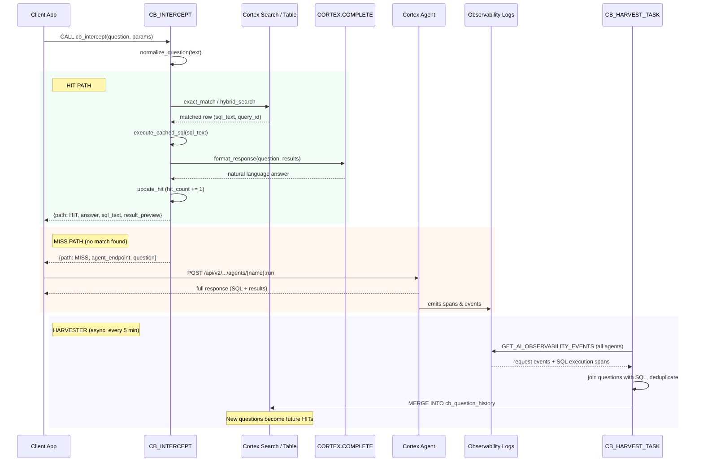

# Circuit Breaker for Cortex Agent

An intercept layer for agentic data applications that reduces cost and latency by caching frequently asked questions.

## What is the Circuit Breaker?

The Circuit Breaker (CB) is an architectural pattern that sits in front of a Cortex Agent to intercept incoming natural language questions. If a question (exact or semantically similar) has been asked before, the cached SQL is re-executed directly — bypassing the agent entirely.

This is designed for **insights-only agentic applications over structured data** — applications where a Cortex Agent generates SQL queries to answer business questions.

### Why use it?

| Benefit | How |
|---------|-----|
| **Cost Reduction** | Frequent questions execute via warehouse compute instead of expensive LLM reasoning tokens |
| **Latency Reduction** | Direct SQL execution + lightweight response formatting is significantly faster than full agent orchestration |

## Architecture



### Key Components

| Component | Role |
|-----------|------|
| **CB_INTERCEPT** | Python SP — normalizes question, tries exact then hybrid match, returns HIT or MISS |
| **cb_question_history** | Table (PK: normalized question) — stores cached SQL, hit counts, recency |
| **Cortex Search Service** | CB_QUESTION_SEARCH — semantic similarity matching with confidence gating |
| **CORTEX.COMPLETE** | Formats raw SQL results into conversational answers on the HIT path |
| **Cortex Agent** | Handles MISSes — full SQL generation with multi-step reasoning |
| **CB_HARVEST_TASK** | Scheduled task — MERGEs agent-generated SQL from observability logs into the cache |

## Reference Implementation

The reference implementation uses TPC-H supply chain data with a Cortex Agent backed by a semantic view. It is deployed using [Snowflake DCM](https://docs.snowflake.com/en/developer-guide/database-change-management/about-dcm) (Database Change Management).

### Prerequisites

- Snowflake account with Cortex AI features enabled
- [SnowCLI](https://docs.snowflake.com/en/developer-guide/snowflake-cli/index) installed (`snow` command available)
- A role with permissions to create databases, warehouses, procedures, tasks, agents, and search services
- A named connection configured in `~/.snowflake/connections.toml`

### Project Structure

```
dcm/
├── manifest.yml                 # DCM project manifest (targets, templating)
├── deploy.sh                    # One-shot deployment script
├── pre_deploy.sql               # Creates database, schema, stage; uploads Python
├── post_deploy.sql              # Creates Cortex Search, Semantic View, Agent
├── cb_core.py                   # Core Python logic (uploaded to stage)
└── sources/definitions/
    ├── compute.sql              # DEFINE WAREHOUSE CB_WH
    ├── tables.sql               # DEFINE TABLE cb_question_history
    ├── procedures.sql           # DEFINE PROCEDURE cb_intercept, cb_harvest_agent_sql
    └── tasks.sql                # DEFINE TASK cb_harvest_task
```

### Deploy

Run the full deployment from the project root:

```bash
cd circuit-breaker-pattern
bash dcm/deploy.sh
```

This executes four steps:

1. **Pre-deploy** — Creates the `CIRCUIT_BREAKER` database, `MAIN` schema, internal stage, and uploads `cb_core.py`
2. **DCM create** — Registers the DCM project (idempotent)
3. **DCM deploy** — Deploys the warehouse, table, procedures, and task via DCM definitions
4. **Post-deploy** — Creates the Cortex Search Service, Semantic View, and Cortex Agent

You can customize the deployment with environment variables:

```bash
CONNECTION=my_connection DEPLOY_ROLE=MY_ROLE bash dcm/deploy.sh
```

| Variable | Default | Description |
|----------|---------|-------------|
| `CONNECTION` | `<SnowCLI connection Name>` | Snowflake connection name |
| `DEPLOY_ROLE` | `<Configured Snowflake Role>` | Role used for deployment |
| `TARGET` | `DEV` | DCM target from manifest |

### Usage

Once deployed, call the interceptor from your application:

```sql
CALL CIRCUIT_BREAKER.MAIN.CB_INTERCEPT(
    'What are the top 10 customers by revenue?',  -- question
    TRUE,                                          -- hybrid_search_enabled
    0.95,                                          -- confidence_threshold
    30,                                            -- recency_window_days
    90,                                            -- expiry_threshold_days
    'mistral-large2',                              -- response_model
    'CIRCUIT_BREAKER.MAIN.CB_TPCH_AGENT',          -- agent_name
    50                                             -- preview_rows
);
```

**Response on HIT:**
```json
{
  "path": "HIT",
  "answer": "The top 10 customers by revenue are...",
  "sql_text": "SELECT ... FROM ...",
  "result_preview": "[{...}, ...]"
}
```

**Response on MISS:**
```json
{
  "path": "MISS",
  "agent_name": "CIRCUIT_BREAKER.MAIN.CB_TPCH_AGENT",
  "agent_endpoint": "/api/v2/databases/circuit_breaker/schemas/main/agents/cb_tpch_agent:run",
  "question": "What are the top 10 customers by revenue?"
}
```

On a MISS, the client calls the agent REST endpoint directly. The harvester task automatically picks up the agent's generated SQL from observability logs and caches it for future HITs.

### Resume the Harvester Task

The harvest task is suspended by default after deployment. Resume it once your agent is operational:

```sql
ALTER TASK CIRCUIT_BREAKER.MAIN.CB_HARVEST_TASK RESUME;
```

### Adapting to Your Own Data

To use the Circuit Breaker with your own agent and data:

1. **Replace the Semantic View** — Edit the `post_deploy.sql` semantic view definition to point at your tables
2. **Replace the Agent** — Update the agent spec in `post_deploy.sql` with your own tools and instructions
3. **Update the `agent_name` parameter** — Pass your agent's fully-qualified name when calling `CB_INTERCEPT`
4. **Adjust thresholds** — Tune `confidence_threshold` (semantic matching strictness) and `recency_window_days` (cache freshness) for your use case
